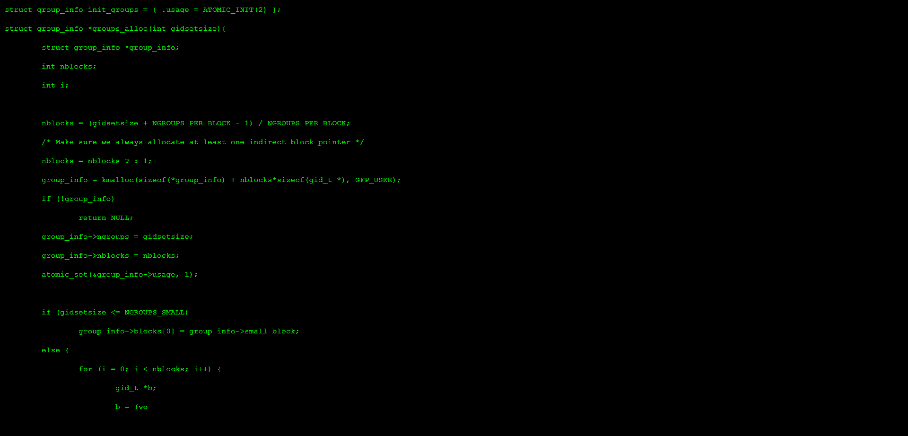
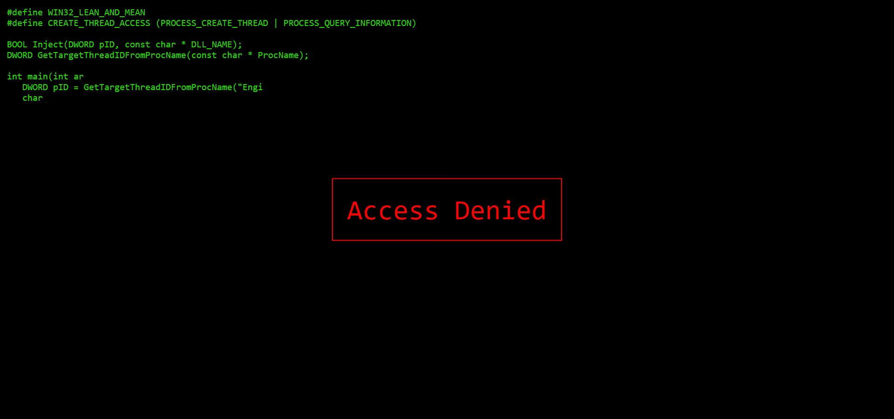
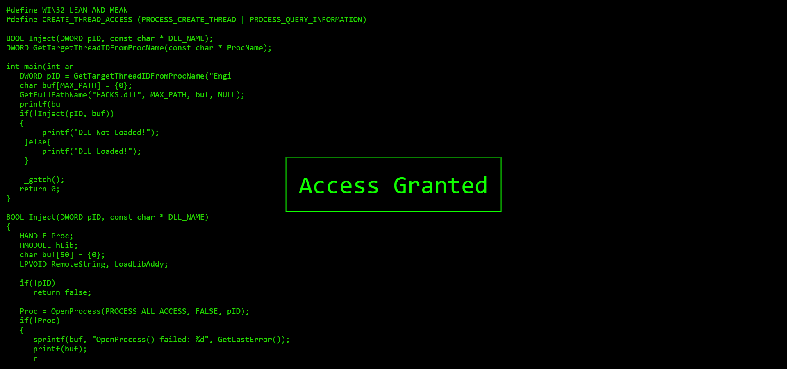

# Hacker Typer Clone

This project is a clone of [Hacker Typer](https://hackertyper.net) and was built using [React](https://reactjs.org).

### [Deployed App on Netlify](https://hackertyper-clone.netlify.app)

## Run it in your system

In the project directory, you can run:

### `npm start`

Runs the app in the development mode.\
Open [http://localhost:3000](http://localhost:3000) to view it in your browser.

The page will reload when you make changes.\
You may also see any lint errors in the console.

## How to use?

Simply open the website, start typing on our keyboard and see the magic. When a message pops up, simply press Esc and you would be able to type again.

## License

MIT
